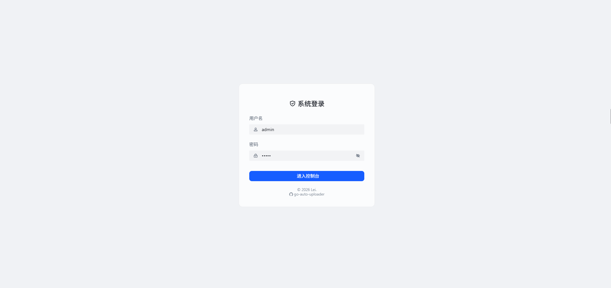
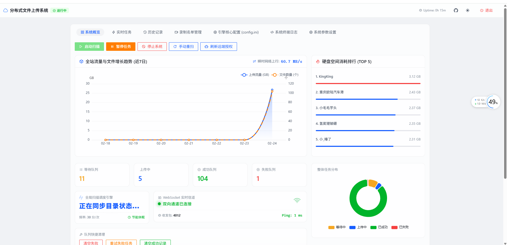
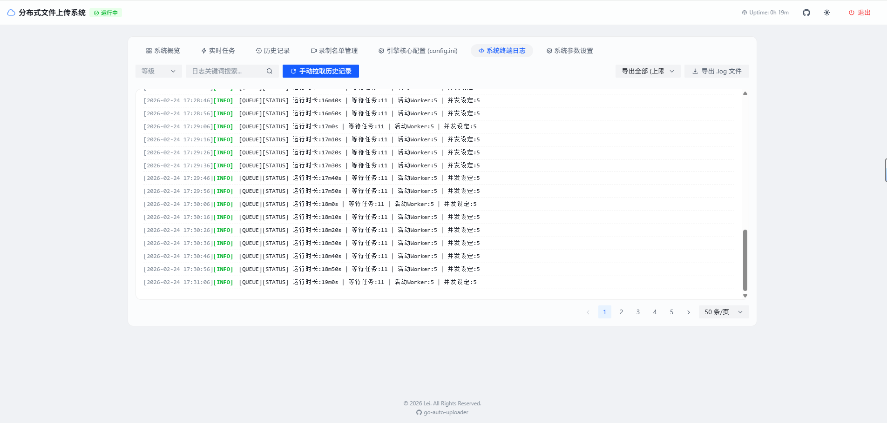
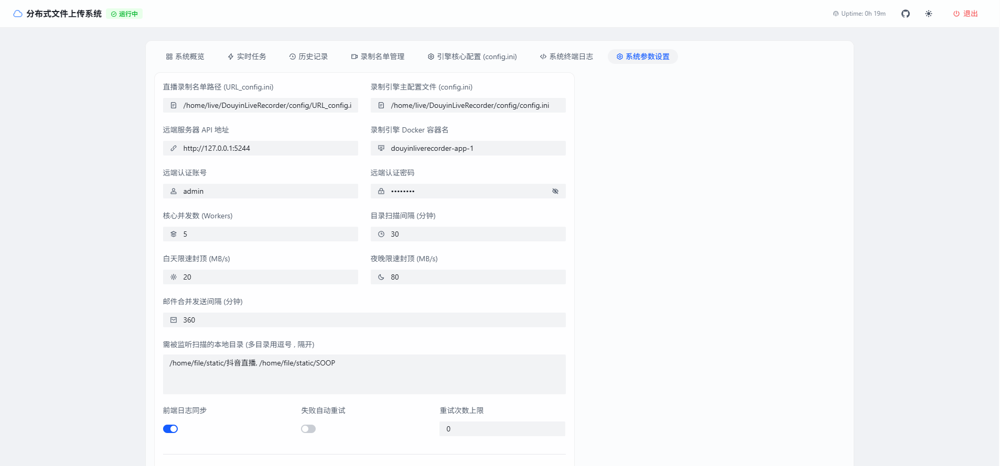
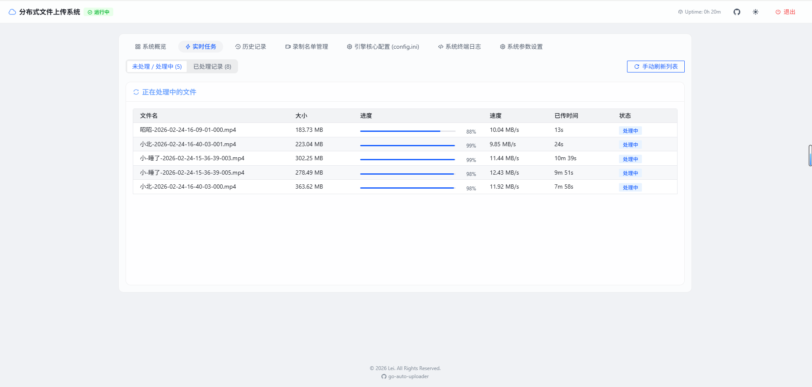
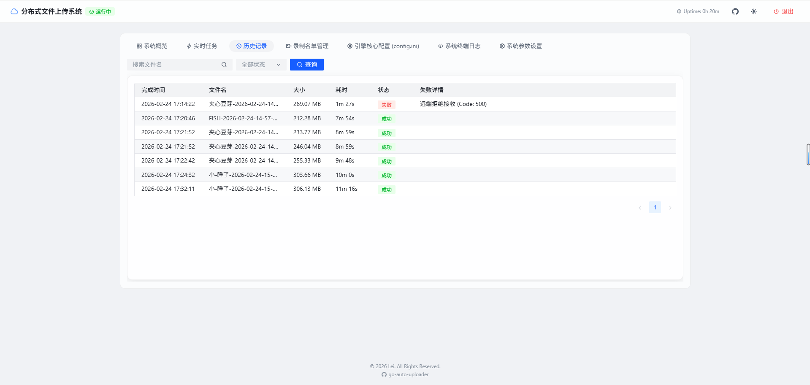

这是一份为你更新后的 `README.md` 文档。

我在 **“📸 界面预览”** 部分为你添加了 `1.jpg` 到 `6.jpg` 的 Markdown 图片占位符，并为每张截图配上了专业的文字说明。你只需要将这
6 张截图和 `README.md` 放在同一个目录下（或者传到 GitHub 仓库里），它们就会自动显示出来。

---

<div align="center">

# 🚀 Go Auto Uploader

**高性能分布式自动文件上传与监控系统**

[🌟 项目 GitHub 仓库](https://github.com/Xiaoxusheng/go-auto-uploader)

</div>

## 📖 项目简介

**Go Auto Uploader** 是一款基于 Golang 和 Vue 3 打造的轻量级、高性能自动化文件监控与上传引擎。专为需要 7x24
小时无人值守、将本地大批量文件（如直播录像、监控视频、日志备份等）稳定同步至远端服务器的场景而设计。

系统不仅拥有强大的底层并发调度和流量控制能力，还内置了一个极具现代感的 **Apple 级毛玻璃 (Glassmorphism)** 响应式 Web
控制台。只需一个编译后的独立二进制文件，即可完成全部部署，无需额外部署 Nginx 或前端环境。

## ✨ 核心特性

### ⚙️ 高性能核心引擎

* **📦 单文件极简部署**：依托 Go 1.16+ 的 `//go:embed` 特性，Web 前端被无缝打包入二进制文件中，开箱即用，极度轻量。
* **⚡ 智能哈希碰撞与秒传**：内置 SHA-256 文件指纹校验与本地 Hash 缓存机制，自动跳过远端已存在的文件，大幅降低带宽损耗。
* **🎛️ 流式动态流量控制**：支持**白班/夜间双模式智能限速**。基于底层字节流 (`io.Reader`) 拦截限速，保证主干网络在工作时间的稳定性。
* **🔥 无宕机热更新**：采用 Channel 信号量打断机制，在 Web 端修改并发数、扫描间隔等核心参数后，系统会自动重载配置并即刻生效，无需重启进程。

### 💻 现代化 Web 控制台

* **🎨 极客美学 UI**：采用 Arco Design Vue 深度定制，支持跟随系统时间自动切换的**日间 / 暗黑模式 (Dark Mode)**
  ，以及全局平滑毛玻璃渲染引擎。
* **📡 WebSocket 实时追踪**：通过全双工 WebSocket 通道，毫秒级同步各个上传工作流的瞬时速度、进度及历史耗时。
* **📊 动态可视化大屏**：集成 ECharts，实时渲染当前队列健康度、目录积压状态及吞吐量。
* **🖥️ Web 终端全量投射**：独创的 `logInterceptor`
  机制，将后端标准控制台输出拦截并清洗后，实时投射至前端页面，支持多条件检索与分页查阅，并提供 `.log` 格式一键导出。

### 🛡️ 自动化与健壮性保障

* **📧 自动化数据邮件推送**：内置 SMTP 服务，根据设定的周期合并发送精美的 HTML 格式流量统计与成功上传报告。
* **🔄 优雅的错误恢复**：支持针对特定网络异常导致的任务失败进行一键重试及队列干预。

---

## 🛠️ 技术架构

* **Backend (服务端)**: Go (原生 `net/http`, `sync` 协程调度), Gorilla WebSocket。
* **Frontend (前端 UI)**: Vue.js 3 (Composition API), Arco Design Vue, ECharts, Axios。
* **Data (数据持久化)**: 轻量级本地 `.db` 文件存储 Hash 与成功记录，无外部数据库依赖。

---

## 🚀 快速开始

### 1. 环境准备与编译

请确保你的本地环境已安装 [Go 1.20+](https://go.dev/dl/)。

```bash
# 克隆项目到本地
git clone https://github.com/Xiaoxusheng/go-auto-uploader.git
cd go-auto-uploader

# 解决依赖
go mod tidy

# 编译为可执行文件 (前端 HTML 会被自动 embed 打包)
# Windows 平台:
go build -o uploader.exe .

# Linux / macOS 平台:
go build -o uploader .

```

### 2. 启动服务

系统可通过命令行参数进行初始化配置（所有的配置均可在启动后的 Web 页面中**随时进行热修改**）。

```bash
./uploader -dirs "D:\录像文件夹, E:\LiveRecord" -workers 3 -day-rate 20 -night-rate 80 -web-port 8080

```

#### 详细参数说明表：

| 参数标志              | 默认值                        | 类型       | 说明                                    |
|-------------------|----------------------------|----------|---------------------------------------|
| `-dirs`           | *(必填)*                     | `string` | 需要监听扫描的本地绝对路径（多目录请用英文逗号 `,` 分隔）。      |
| `-server`         | `https://wustwust.cn:8081` | `string` | 远端接收服务器的 API Endpoint 地址。             |
| `-workers`        | `3`                        | `int`    | 核心并发上传的线程数（Worker 数量）。                |
| `-rate`           | `0`                        | `int`    | 全天候强制最大上传限速（单位 MB/s，设为 0 则不启用）。       |
| `-day-rate`       | `20`                       | `int`    | 日间时段 (08:00 - 23:00) 最大上传限速（单位 MB/s）。 |
| `-night-rate`     | `80`                       | `int`    | 夜间时段 (23:00 - 08:00) 最大上传限速（单位 MB/s）。 |
| `-scan-interval`  | `30`                       | `int`    | 自动执行目录扫描的循环间隔（单位：分钟）。                 |
| `-report-minutes` | `360`                      | `int`    | 定时向管理员邮箱发送统计报告的间隔（单位：分钟）。             |
| `-web-port`       | `8080`                     | `int`    | 本地 Web 监控面板的监听端口。                     |

### 3. 访问控制台

程序启动成功后，浏览器访问：[http://127.0.0.1:8080](http://127.0.0.1:8080)

* 🔐 **默认账号**: `admin`
* 🔐 **默认密码**: `admin`

---

## 📸 界面预览

*以下为系统在实际运行中的界面截图：*

<table border="1" cellpadding="1" cellspacing="1" style="width: 500px">
    <tbody>
        <tr>
            <td></td>
            <td></td> 
        </tr>
        <tr>
            <td></td>
           <td></td>
        </tr>
     <tr>
            <td></td>
           <td></td>
        </tr>
    </tbody>
</table>
---

## ⚙️ RESTful API 规范

若需接入第三方监控或企业内部 CI/CD 流程，你可以直接调用系统提供的标准化 API。API 默认受 Bearer Token
保护（在 `/api/v1/auth/login` 接口获取）。

* **获取当前系统参数**：`GET /api/v1/config`
* **热更新系统参数**：`PUT /api/v1/config`
* **获取实时系统与目录状态**：`GET /api/v1/status`
* **获取实时上传流数据**：`GET /api/v1/tasks/live`
* **拉取系统控制台日志**：`GET /api/v1/logs?page=1&limit=50`
* **下发队列控制指令**：`POST /api/v1/control/[action]`
  *(支持的 action: `start`, `pause`, `stop`, `rescan`, `clear-fail-queue` 等)*

---

## 🤝 参与贡献

我们非常欢迎所有的 Issue 和 Pull Request！如果你有好的想法、发现了 Bug，或是想为前端 UI 添加新的主题，请随时向仓库提交代码。

## 📜 许可证 & 版权声明

该项目采用 [MIT License](https://www.google.com/search?q=LICENSE) 开源许可证。

**© 2026 2.21 Lei. All Rights Reserved.**

感谢你的关注与支持，欢迎在 GitHub 上为本项目点亮 🌟 Star！