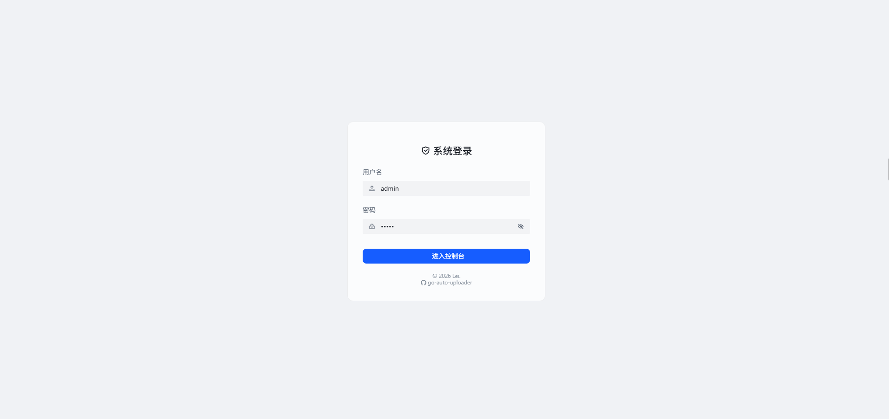
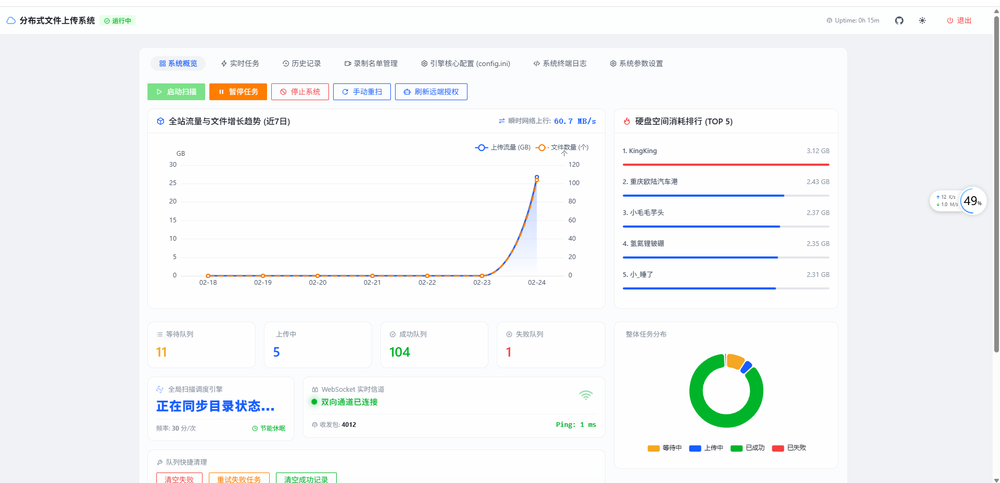
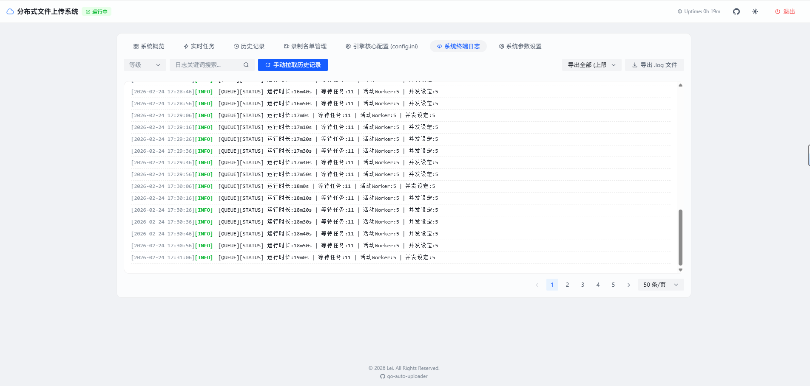
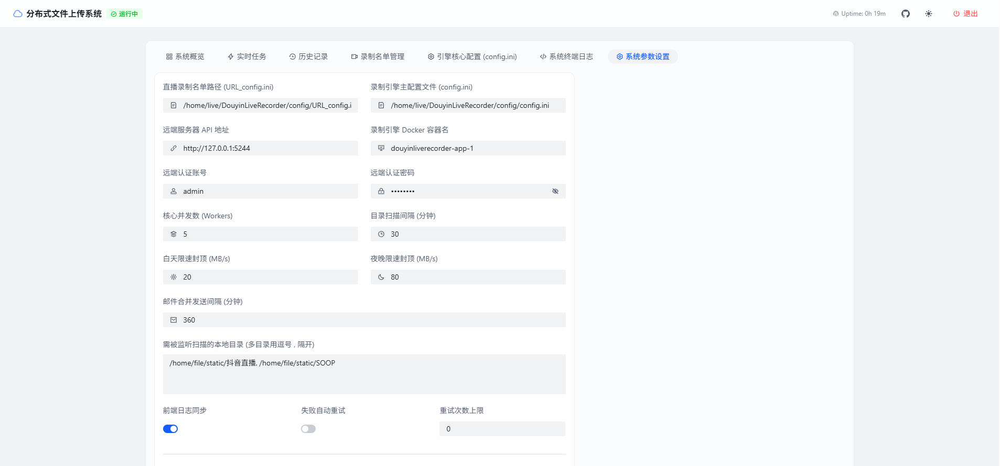
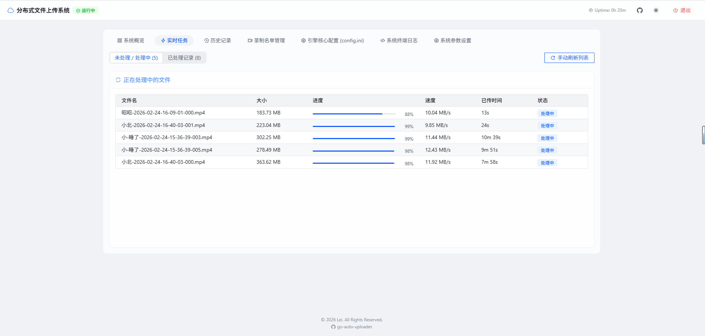
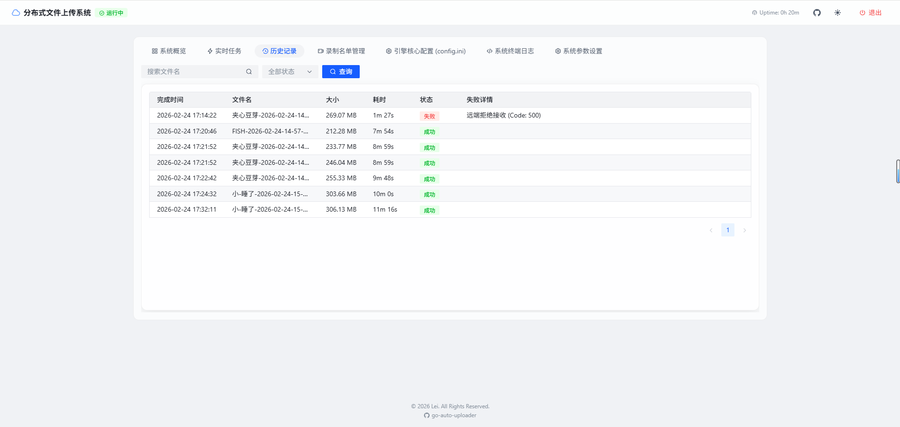
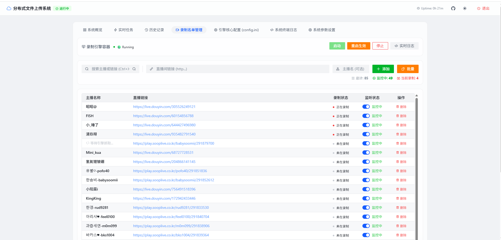
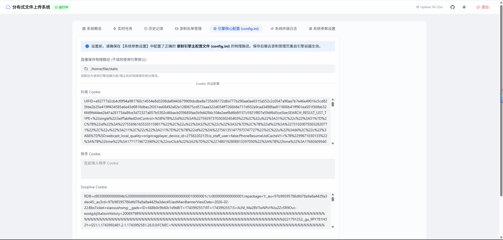

<div align="center">

# 🚀 Go Auto Uploader

**高性能分布式自动文件上传与监控系统**

[🌟 项目 GitHub 仓库](https://github.com/Xiaoxusheng/go-auto-uploader)

</div>

## 📖 项目简介

**Go Auto Uploader** 是一款基于 Golang 和 Vue 3 打造的轻量级、高性能自动化文件监控与上传引擎。专为需要 7x24 小时无人值守、将本地大批量文件（如直播录像、监控视频、日志备份等）稳定同步至远端服务器的场景而设计。

**🤝 开源生态强强联手**：本项目天生为流媒体录制与云端归档而打造，原生深度对接了 **[ihmily/DouyinLiveRecorder](https://github.com/ihmily/DouyinLiveRecorder)**（知名开源直播录制引擎）与 **[OpenList](https://github.com/OpenListTeam/OpenList)**（开源多云端存储文件管理系统）两大开源巨头。它作为核心的“智能中枢”，完美串联了从“全自动开播录制”到“全自动多云盘归档”的完整工作流闭环。

系统不仅拥有强大的底层并发调度和流量控制能力，还内置了一个极具现代感的 **Apple 级毛玻璃 (Glassmorphism)** 响应式 Web 控制台。只需一个编译后的独立二进制文件，即可完成全部部署，无需额外部署 Nginx 或前端环境。

## ✨ 核心特性

### 🔗 双引擎与生态深度联动 (Dual-Engine Integration)

本项目采用创新的 **“双引擎驱动 (Dual-Engine)”** 架构，既能完美驾驭外部重型生态，又拥有独立的轻量级内建能力：

* **🎥 完美驾驭外置 DouyinLiveRecorder**:
  * **容器级可视化守护**：支持在 Web 控制台直接实时探测录制引擎 Docker 容器的运行状态，并提供一键启停、重启、物理终端日志实时拉取功能。
  * **名单与凭证热穿透**：独创无损 INI 精准覆写算法。在网页端即可随时批量增删主播录制名单 (`URL_config.ini`)，或动态注入多平台 Cookie (`config.ini`)，彻底告别繁琐的 SSH 文本编辑。
* **🎙️ 内置极速轻量录制引擎 (Built-in Recorder)**:
  * **开箱即用**：无需部署外部 Docker 容器，系统原生内置对主流直播平台的监听与录制支持，依托轻量级 FFmpeg 进程调度，极大降低系统内存占用。
  * **底层热重载与自动固化**：修改底层物理文件 `urls.txt`，3秒内毫秒级感知并热推送到所有设备的 Web 端；抓取到的主播名称自动固化写入物理文件，重启永不丢失。
  * **智能中断唤醒**：内置引擎一旦捕获到主播开播，将立刻下发硬件级中断信号，瞬间“踹醒”处于休眠状态的上传扫描调度器，极速切入狂暴上传模式。
* **☁️ 无缝对接 OpenList (及 AList 生态)**:
  * **API 直连聚合存储**：全面对接 OpenList 远端服务器 API，将录制好的庞大视频文件稳定、高速地推送到阿里云盘、115网盘、OneDrive 等数十种被挂载的云存储节点。
  * **动态鉴权与心跳保护**：系统支持配置 OpenList 的远端认证账号密码，自动完成 API 鉴权、Token 获取与定期的强制刷新，保障 7x24 小时跨云传输的绝对稳定。

### ⚙️ 高性能核心引擎

* **📦 单文件极简部署**：依托 Go 的 `//go:embed` 特性，Web 前端被无缝打包入二进制文件中，开箱即用，极度轻量。
* **⚡ 智能哈希碰撞与秒传**：内置 SHA-256 文件指纹校验与本地 Hash 缓存机制，自动跳过远端已存在的文件，大幅降低带宽损耗。
* **🎛️ 流式动态流量控制**：支持**白班/夜间双模式智能限速**。基于底层字节流 (`io.Reader`) 拦截限速，保证主干网络在工作时间的稳定性。
* **🔥 无宕机热更新**：采用 Channel 信号量打断机制，在 Web 端修改并发数、扫描间隔等核心参数后，系统会自动重载配置并即刻生效，无需重启进程。

### 💻 现代化 Web 控制台

* **🎨 极客美学 UI**：采用 Arco Design Vue 深度定制，支持跟随系统时间自动切换的**日间 / 暗黑模式 (Dark Mode)**，以及全局平滑毛玻璃渲染引擎。
* **📡 WebSocket 实时追踪**：通过全双工 WebSocket 通道，毫秒级同步各个上传工作流的瞬时速度、进度及历史耗时。
* **📊 动态可视化大屏**：集成 ECharts，实时渲染全站流量趋势、硬盘消耗排行及整体任务分布状态。
* **🖥️ Web 终端全量投射**：独创的 `logInterceptor` 机制，将后端标准控制台输出拦截并清洗后，实时投射至前端页面，支持多条件检索与分页查阅，并提供 `.log` 格式一键导出。

### 🛡️ 自动化与健壮性保障

* **📧 自动化数据邮件推送**：内置 SMTP 服务，根据设定的周期合并发送精美的 HTML 格式流量统计与成功上传报告。
* **🔄 优雅的错误恢复**：支持针对特定网络异常导致的任务失败进行一键重试及队列干预。


---

## 📸 界面预览

*以下为系统在实际运行中的界面截图：*

<table border="1" cellpadding="1" cellspacing="1" style="width: 500px">
    <tbody>
        <tr>
            <td></td>
            <td></td> 
        </tr>
        <tr>
            <td></td>
           <td></td>
        </tr>
     <tr>
            <td></td>
           <td></td>
        </tr>
     <tr>
            <td></td>
           <td></td>
        </tr>
    </tbody>
</table>
---

## 📡 WebSocket 实时数据协议规范

系统通过单路全双工 WebSocket (`/ws/live`) 向前端实时推送业务数据。所有消息均采用 JSON 格式，结构为 `{ "type": "类型", "payload": 载荷数据 }`。

### 📊 1. 大屏看板与统计数据

**全站流量与排行榜 (`type: "statsTrend"`)**
驱动近7日流量增长面积图与硬盘消耗 TOP 5 排名。
```json
{
  "type": "statsTrend",
  "payload": {
    "rank": [
      { "name": "KingKing", "size": 3.123 },
      { "name": "小毛毛芋头", "size": 2.369 }
    ],
    "trend": [
      { "date": "02-23", "size": 0, "count": 0 },
      { "date": "02-24", "size": 17.458, "count": 66 }
    ]
  }
}

```

**瞬时网络速率 (`type: "trafficMetrics"`)**
实时展示系统的瞬时上传带宽消耗，每 2~3 秒推送。

```json
{
  "type": "trafficMetrics",
  "payload": {
    "speed": 52028120, // 字节每秒 (Bytes/s)
    "time": 1708765432000
  }
}

```

**队列分布状态 (`type: "queueStatus"`)**
驱动任务分布饼图，统计当前各类任务的实时数量。

```json
{
  "type": "queueStatus",
  "payload": {
    "waiting": 5,
    "uploading": 2,
    "success": 120,
    "failed": 0
  }
}

```

### ⚡ 2. 任务流与进度追踪

**实时上传进度 (`type: "uploadProgress"`)**
高频推送，驱动上传任务列表的进度条与速度显示。

```json
{
  "type": "uploadProgress",
  "payload": {
    "id": "task-1708765432",
    "filename": "streamer_20260224.mp4",
    "path": "D:\\Record\\streamer_20260224.mp4",
    "size": 1073741824,
    "uploaded": 536870912,
    "speed": 10485760,
    "status": "uploading",
    "startTime": 1708765000000
  }
}

```

**任务完成通知 (`type: "taskDone"`)**
当单个任务成功上传或遭遇错误失败时触发。

```json
{
  "type": "taskDone",
  "payload": {
    "id": "task-1708765432",
    "status": "success", // 或 "fail"
    "progress": 100,
    "size": 1073741824,
    "error": "Token expired" // 仅失败时存在
  }
}

```

### 🚀 3. 系统调度与控制

**系统核心状态 (`type: "systemStatus"`)**
包含全局雷达倒计时、动态休眠时间及目录统计情况。

```json
{
  "type": "systemStatus",
  "payload": {
    "running": true,
    "workers": 3,
    "scanningInterval": 30,
    "dynamicInterval": 5, // 动态调节后的频率
    "nextScanTime": 1708765900000,
    "uptime": 3600,
    "dirs": [
      {
        "path": "D:\\Record",
        "pendingFiles": 5,
        "uploadedFiles": 100,
        "totalSize": 10737418240,
        "uploadedSize": 5368709120
      }
    ]
  }
}

```

**扫描启动事件 (`type: "scanStarted"`)**
当引擎开始探测目录时触发（前端可借此弹出提示）。

```json
{
  "type": "scanStarted",
  "payload": {
    "time": 1708765000000,
    "dirs": ["D:\\Record"],
    "interval": 5,
    "workers": 3,
    "trigger": "auto" // auto, manual-start, rescan, config-change
  }
}

```

**扫描完毕事件 (`type: "scanFinished"`)**
当引擎完成目录比对后触发，告知发现了多少新文件。

```json
{
  "type": "scanFinished",
  "payload": {
    "time": 1708765100000,
    "added": 12 // 压入队列的新文件数量
  }
}

```

### 🎥 4. 直播引擎生态联动

**录制引擎容器状态 (`type: "recorderStatus"`)**
实时投射底层 Docker 容器的状态。

```json
{
  "type": "recorderStatus",
  "payload": "running" // running, exited, 离线/异常 等
}

```

**热点录制主播探测 (`type: "activeStreamers"`)**
动态识别正在写入视频文件的主播，前端借此展示“录制红点”。

```json
{
  "type": "activeStreamers",
  "payload": ["KingKing", "小毛毛芋头"]
}

```

**主播配置名单同步 (`type: "streamersData"`)**
向所有在线终端同步最新的录制名单数据（防冲突覆盖）。

```json
{
  "type": "streamersData",
  "payload": [
    { "name": "KingKing", "url": "[https://live.douyin.com/123](https://live.douyin.com/123)", "active": true },
    { "name": "未知", "url": "[https://live.kuaishou.com/456](https://live.kuaishou.com/456)", "active": false }
  ]
}

```

### 🚨 5. 诊断与告警

**系统实时终端日志 (`type: "newLog"`)**
拦截 Go 后端标准输出，实时推送给前端日志查看器。

```json
{
  "type": "newLog",
  "payload": {
    "Time": "15:04:05",
    "Level": "info", // info, warn, error
    "Message": "系统初始化完成，启动中...",
    "Error": ""
  }
}

```

**全局告警强推 (`type: "systemAlert"`)**
遇到致命错误（如认证失效、API拒绝）时主动触发弹窗。

```json
{
  "type": "systemAlert",
  "payload": {
    "level": "error", // info, success, warning, error
    "title": "上传遭拒绝",
    "message": "远端返回 Code 401，请检查 Token 是否已过期。",
    "time": "15:04:05"
  }
}

```

---

## 🛠️ 技术架构

* **Backend (服务端)**: Go (原生 `net/http`, `sync` 协程调度), Gorilla WebSocket。
* **Frontend (前端 UI)**: Vue.js 3 (Composition API), Arco Design Vue, ECharts, Axios。
* **Data (数据持久化)**: 轻量级本地 `.db` 文件存储 Hash 与成功记录，无外部数据库依赖。

---

## 🚀 快速开始

### 1. 环境准备与编译

请确保你的本地环境已安装 [Go 1.20+](https://go.dev/dl/)。

```bash
# 克隆项目到本地
git clone [https://github.com/Xiaoxusheng/go-auto-uploader.git](https://github.com/Xiaoxusheng/go-auto-uploader.git)
cd go-auto-uploader

# 解决依赖
go mod tidy

# 编译为可执行文件 (前端 HTML 会被自动 embed 打包)
# Windows 平台:
go build -o uploader.exe .

# Linux / macOS 平台:
go build -o uploader .

```

### 2. 启动服务

系统可通过命令行参数进行初始化配置（所有的配置均可在启动后的 Web 页面中**随时进行热修改**）。

```bash
./uploader -dirs "D:\录像文件夹, E:\LiveRecord" -workers 3 -day-rate 20 -night-rate 80 -web-port 8080

```

#### 详细参数说明表：

| 参数标志 | 默认值 | 类型 | 说明 |
| --- | --- | --- | --- |
| `-dirs` | *(必填)* | `string` | 需要监听扫描的本地绝对路径（多目录请用英文逗号 `,` 分隔）。 |
| `-server` | `https://wustwust.cn:8081` | `string` | 远端 OpenList 接收服务器的 API Endpoint 地址。 |
| `-workers` | `3` | `int` | 核心并发上传的线程数（Worker 数量）。 |
| `-rate` | `0` | `int` | 全天候强制最大上传限速（单位 MB/s，设为 0 则不启用）。 |
| `-day-rate` | `20` | `int` | 日间时段 (08:00 - 23:00) 最大上传限速（单位 MB/s）。 |
| `-night-rate` | `80` | `int` | 夜间时段 (23:00 - 08:00) 最大上传限速（单位 MB/s）。 |
| `-scan-interval` | `30` | `int` | 自动执行目录扫描的循环间隔（单位：分钟）。 |
| `-report-minutes` | `360` | `int` | 定时向管理员邮箱发送统计报告的间隔（单位：分钟）。 |
| `-web-port` | `8080` | `int` | 本地 Web 监控面板的监听端口。 |

### 3. 访问控制台

程序启动成功后，浏览器访问：[http://127.0.0.1:8080](http://127.0.0.1:8080)

* 🔐 **默认账号**: `admin`
* 🔐 **默认密码**: `admin`

---

## ⚙️ RESTful API 规范

若需接入第三方监控或企业内部 CI/CD 流程，你可以直接调用系统提供的标准化 API。API 默认受 Bearer Token 保护（在 `/api/v1/auth/login` 接口获取）。

* **获取当前系统参数**：`GET /api/v1/config`
* **热更新系统参数**：`PUT /api/v1/config`
* **获取实时系统与目录状态**：`GET /api/v1/status`
* **获取实时上传流数据**：`GET /api/v1/tasks/live`
* **拉取系统控制台日志**：`GET /api/v1/logs?page=1&limit=50`
* **下发队列控制指令**：`POST /api/v1/control/[action]`
  *(支持的 action: `start`, `pause`, `stop`, `rescan`, `clear-fail-queue` 等)*

---

## 🤝 参与贡献

我们非常欢迎所有的 Issue 和 Pull Request！如果你有好的想法、发现了 Bug，或是想为前端 UI 添加新的主题，请随时向仓库提交代码。

## 📜 许可证 & 版权声明

该项目采用 MIT License 开源许可证。

**© 2026 Lei. All Rights Reserved.**

感谢你的关注与支持，欢迎在 GitHub 上为本项目点亮 🌟 Star！

## ⚠️ 免责声明

本工具仅供个人学习、技术研究与自动化测试使用。请勿将录制的视频用于商业用途或侵犯他人知识产权。使用本工具所产生的一切法律及相关后果由使用者自行承担。