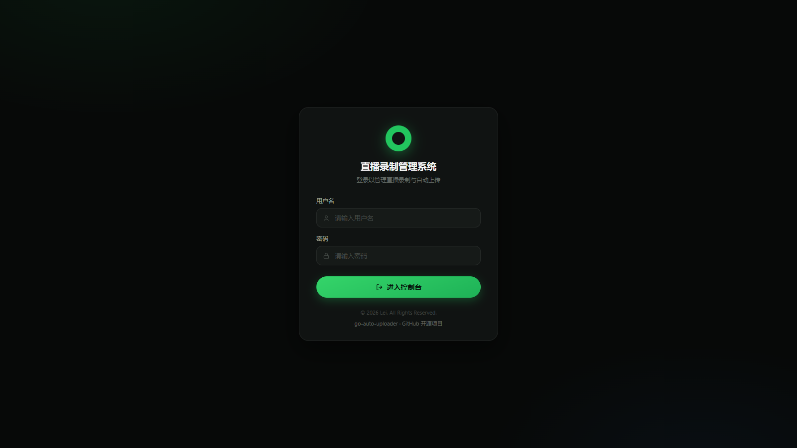
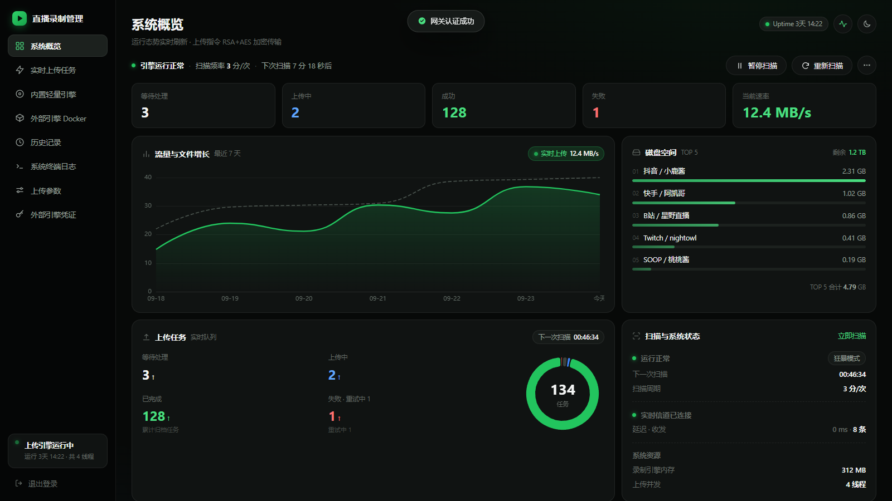
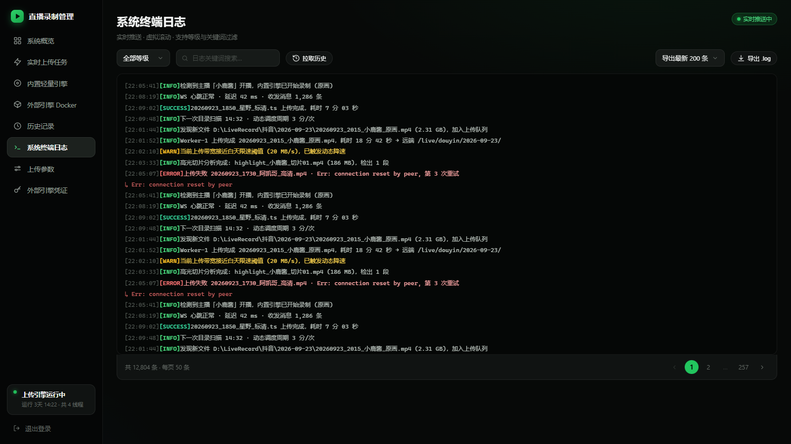
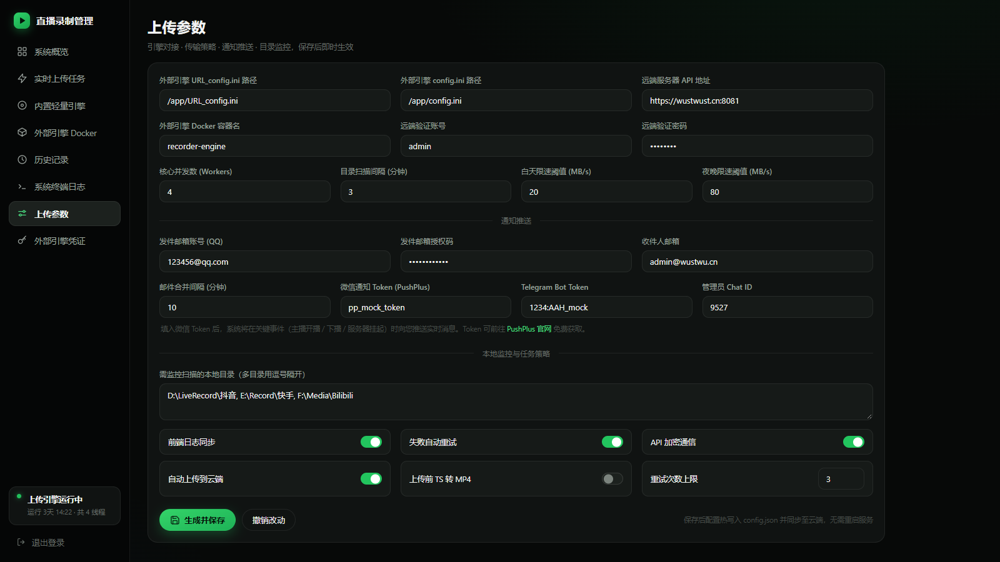
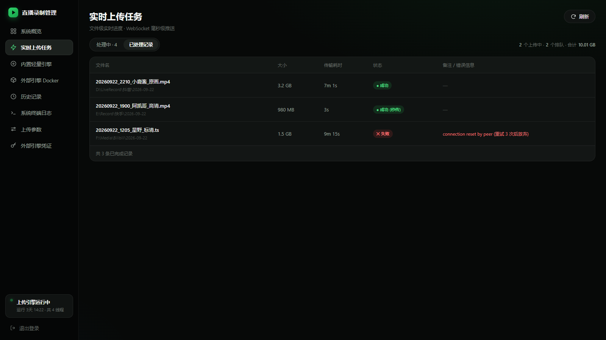
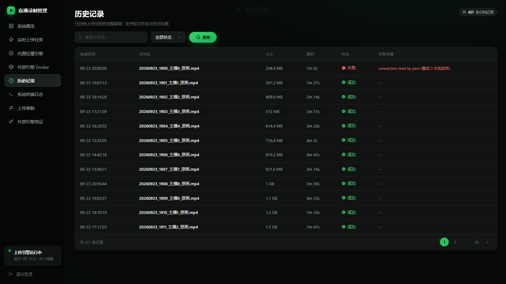
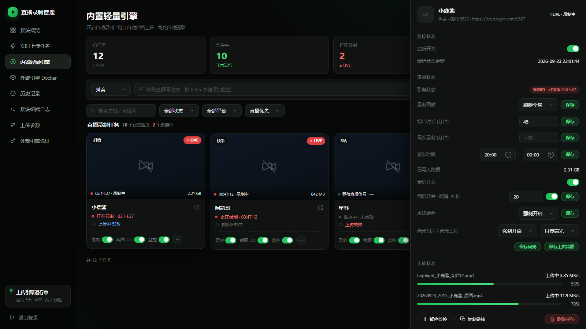
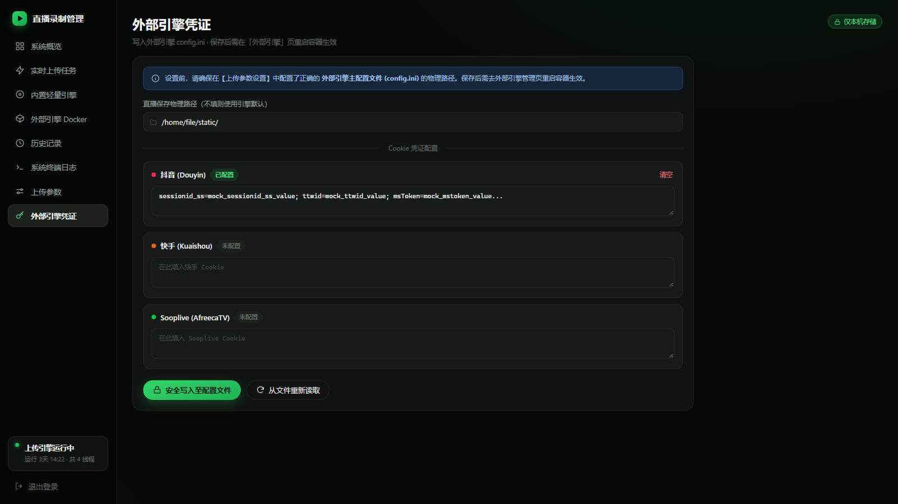

<div align="center">

# 🚀 Go Auto Uploader

**直播自动录制 · 智能切片归档 · 7x24 无人值守一体化系统**

[🌟 项目 GitHub 仓库](https://github.com/Xiaoxusheng/go-auto-uploader) &nbsp; | &nbsp; [📝 查看更新日志 (Changelog)](CHANGELOG.md) &nbsp; | &nbsp; [📚 更多文档 (docs/)](docs/)

</div>

## 📖 项目简介

**Go Auto Uploader** 是一款基于 Golang 与 Vue 3 打造的直播录制与云盘归档一体化系统，为主播粉丝、录播组与个人归档玩家设计：**主播一开播就自动录制，切片一录完就自动上传到你的云盘**，全程无人值守。

- **🎙️ 内置轻量录制引擎**：原生支持 **抖音 / 快手 / B站 / Twitch / SOOP(AfreecaTV)** 五大平台，无需部署任何外部容器，FFmpeg 直拉直播流落盘。
- **☁️ 无缝对接 OpenList / AList**：录制产物自动推送到阿里云盘、115、OneDrive 等数十种被挂载的存储节点，SHA-256 秒传去重，绝不浪费带宽。
- **🎛️ 单主播级精细控制**：每个直播间可独立设置录屏/截屏开关、画质、最长录制时长、录制时段、水印、截图间隔，网页点选即生效。
- **📦 单文件极简部署**：Web 控制台经 `//go:embed` 打进二进制，一个可执行文件 + 一个 FFmpeg 就是全部依赖。

系统同时兼容外置 **[ihmily/DouyinLiveRecorder](https://github.com/ihmily/DouyinLiveRecorder)** Docker 容器作为录制引擎（双引擎架构），并提供暗色沉浸风格的响应式 Web 控制台，手机、平板、桌面均可操控。

## ✨ 核心特性

### 🎙️ 内置轻量录制引擎

* **五平台开箱即用**：抖音（短链自动换算 web_rid）、快手、B站（`b23.tv` 短链解析、SESSDATA 解锁原画）、Twitch（`HTTPS_PROXY` 代理、断流 8 秒快速重连）、SOOP。
* **单主播精细控制**：任务详情抽屉内直接调整以下参数，全部随名单文件持久化、重启不丢：

  | 能力 | 说明 |
  | --- | --- |
  | 录屏 / 截屏开关 | 只录视频、只定时截图、或双开 |
  | 画质覆盖 | 原画蓝光 / 高清 / 标清，档位不存在时自动就近降档 |
  | 最长录制时长 | 单场录满自动安全收尾，本场不续录，下播后自动恢复 |
  | 切片时长 | 主播专属切片间隔，录满自动切下个文件且录制不中断，缺省跟随全局 |
  | 录制时段 | 仅在指定时间窗内录制（支持跨午夜），窗口外只探测不拉流 |
  | 高光切片 | 强制开 / 强制关本主播的自动高光提取，缺省跟随全局 |
  | 只传高光 | 原片不上传，远端只收高光片段，分析结束后本地原片自动清理 |
  | 水印三态 | 跟随全局 / 强制开 / 强制关，作用于截图与视频烧录 |
  | 截图间隔 | 主播专属定期截图间隔，热生效不断流 |

* **Cookie 失效检测与告警**：B 站、Twitch 每 30 分钟走官方接口权威探活，全平台基于解析结果的连续报错被动检测；Cookie 失效即刻经微信 / Telegram 推送告警，控制台 Cookie 面板同步标红，杜绝"默默漏录好几天"。
* **录制统计**：累计录制体积、近 14 天录制趋势、主播占用 Top 10、近 7 天上传流量，一屏总览。
* **抗抖动设计**：开播/断流防抖缓冲池避免状态横跳，断流指数退避防止 CDN 抖动打满 CPU；配置热重载自动重开会话且不误报下播。
* **名单热重载**：手工编辑 `builtin_urls.txt`，3 秒内毫秒级感知并同步到所有在线终端；解析到的主播名自动固化回写。

### 🌟 高光切片系统

* **双因子智能判定**：录制切片落盘后离线分析，按「画面运动量 + 音频能量」加权评分（默认 0.8/0.2），综合分滑动平均平滑后按 z 分自适应判定活跃片段，自动裁出高光时刻，参数（灵敏度阈值、最短/单个最长时长、每片产出上限等）均可调。
* **「只传高光」模式**：开启后该主播原片不上传，远端只收高光片段，截图照常上传；全局开关 + 单主播两级覆盖，热生效不中断录制。
* **删源安全闸**：原片删除前必须经高光模块判定（被认领/有定论/上传凭证已确认），源片保留期可配，杜绝「高光还没跑完原片先没了」与磁盘被积压切片吃满。
* **离线评估工具 (`cmd/hleval`)**：对已录切片批量跑判定并输出 Precision/Recall/F1，用于参数校准与算法迭代。

### 🎥 外置 DouyinLiveRecorder（可选双引擎）

* **容器级可视化守护**：Web 控制台实时探测 Docker 容器状态，一键启停、重启、拉取物理终端日志。
* **名单与凭证热穿透**：无损 INI 精准覆写，网页端直接批量增删录制名单、注入多平台 Cookie，告别 SSH 手改配置。

### ☁️ OpenList / AList 自动归档

* **API 直连多云存储**：对接 OpenList 远端 API，将录像稳定推送至阿里云盘、115、OneDrive 等挂载节点。
* **SHA-256 秒传去重**：本地指纹库（百万级记录秒级加载）自动跳过远端已有文件；远端"同名冲突"按已上传幂等处理，不堆积失败告警。
* **智能中断唤醒**：内置引擎捕获开播即刻触发上传扫描器介入，录制-归档链路无缝衔接。
* **动态鉴权与心跳保护**：自动完成 OpenList Token 获取与定期刷新，保障 7x24 跨云传输稳定。

### ⚙️ 高性能核心引擎

* **流式动态限速**：白班/夜间双模式智能限速，基于 `io.Reader` 字节流拦截，工作时间不抢主干带宽。
* **无宕机热更新**：Web 端修改并发数、扫描间隔等参数后自动重载即刻生效，无需重启进程。
* **TS → MP4 无损转码**：切片录制完成后自动封装 MP4，便于回看与二传。

### 🔐 商业级数据安全

* **动态 RSA+AES 混合加密**：RSA-2048 密钥协商 + AES-256-GCM 载荷加密的完美前向保密（PFS）通道，Axios 拦截器无感加解密，业务代码零侵入；控制台可在明文调试与密文模式间一键切换。
* **全站强制鉴权**：所有 API 与 WebSocket 通道必须持有效令牌，256 位高熵随机令牌 + 30 天 TTL 且落盘持久化（进程重启会话不丢），修改账号或密码立即作废全部历史会话；口令常数时间比对，连续失败 10 次锁定 5 分钟防爆破。
* **SSRF 防火墙**：图片代理在建连前校验全部解析 IP，环回/内网/链路本地/组播网段一律拒绝，并以校验后 IP 直连杜绝 DNS 重绑定。
* **弱口令告警**：检测到默认 admin/admin 时启动即打印高危告警，可在 `config.json` 自定义控制台凭据。

### 💻 现代化 Web 控制台

* **暗色沉浸式重设计**：暗色底 + 单一绿色强调色的沉浸式界面，左侧边栏导航 + 药丸操作按钮，卡片/表格双视图自由切换；支持日间模式，桌面与移动端双布局。
* **零 UI 框架依赖**：前端组件（开关、下拉、分页、弹窗、抽屉等）全部手写实现，无第三方组件库，`//go:embed` 打进二进制即开即用。
* **WebSocket 实时追踪**：毫秒级同步上传速度、进度、录制状态、系统探针数据；500ms 聚合广播防抖杜绝高并发推送卡顿。
* **ECharts 动态大屏**：近 7 日流量趋势、主播硬盘消耗排行、任务分布实时渲染。
* **实时日志投射**：后端标准输出拦截清洗后实时投射前端，多条件检索、分页查阅、`.log` 一键导出。
* **硬件资源探针**：磁盘剩余空间与 FFmpeg 进程物理内存（RSS）实时下发，录制不再"盲盒"。

### 📧 自动化通知与机器人

* **多通道推送**：微信（Server 酱）、Telegram Bot、SMTP 邮件周期报告，开播/下播/Cookie 告警/录制事件全量可推送。
* **Telegram Bot 远程操控**：开播即收通知，支持机器人交互查询与控制。

---

## 📸 界面预览

*以下为系统在实际运行中的界面截图：*

<table border="1" cellpadding="1" cellspacing="1" style="width: 100%">
    <tbody>
        <tr>
            <td></td>
            <td></td>
        </tr>
        <tr>
            <td></td>
           <td></td>
        </tr>
     <tr>
            <td></td>
           <td></td>
        </tr>
     <tr>
            <td></td>
           <td></td>
        </tr>
    </tbody>
</table>

---

## ⌨️ 单主播名单行速查

内置引擎的录制名单（`builtin_urls.txt`，Web 端「批量添加」与单条添加均可写入）每行一个直播间，行尾可追加逗号分隔的控制后缀：

```
https://live.douyin.com/12345,主播:某某,画质:uhd,录制时长:240,时段:20:00-24:00
https://live.bilibili.com/8888,主播:B站主播,截图间隔:30,水印:0,高光:1
#https://live.kuaishou.com/666,主播:已暂停的主播,录屏:0,截屏:1
```

| 后缀 | 取值 | 说明 |
| --- | --- | --- |
| `#`（行首） | — | 暂停该主播的监控 |
| `主播:` | 任意名称 | 自定义主播名（留空自动抓取并固化） |
| `录屏:` | `1` / `0` | 是否录制视频文件 |
| `截屏:` | `1` / `0` | 是否定期保存截图 |
| `截图间隔:` | 秒数 | 主播专属截图间隔，缺省跟随全局（默认 20s） |
| `水印:` | `1` / `0` | 强制开 / 强制关水印，缺省跟随全局 |
| `画质:` | `uhd` / `hd` / `sd` | 主播专属画质，缺省跟随全局默认画质 |
| `录制时长:` | 分钟 | 单场最长录制时长，录满即安全收尾且本场不续录 |
| `切片:` | 分钟 | 主播专属切片时长，录满自动切下个文件（录制不中断），缺省跟随全局 |
| `时段:` | `HH:MM-HH:MM` | 录制时间窗（支持跨午夜，按服务器本地时间），窗口外只探测不录制 |
| `高光:` | `1` / `0` | 强制开 / 关本主播自动高光提取，缺省跟随全局 |
| `只传高光:` | `1` / `0` | 原片不上传只收高光片段，分析结束后本地原片自动清理 |

所有后缀均可在 Web 控制台「任务详情」抽屉中点选修改，自动回写名单文件。

---

## 🚀 快速开始

### 1. 环境准备

1. **Go 语言环境** [Go 1.20+](https://go.dev/dl/)。
2. **FFmpeg（⚠️ 必须）**：内置录制引擎与截帧高度依赖系统 FFmpeg 进程。
   * **Windows**：下载预编译版并将 `ffmpeg.exe` 置于环境变量 `Path`，或直接放在编译产物同级目录。
   * **Linux**：`sudo apt install ffmpeg`（Debian/Ubuntu）或 `sudo yum install ffmpeg`（CentOS）。
   * **macOS**：`brew install ffmpeg`。

### 2. 编译

```bash
git clone https://github.com/Xiaoxusheng/go-auto-uploader.git
cd go-auto-uploader
go mod tidy

# Windows
go build -o uploader.exe ./cmd/uploader

# Linux / macOS
go build -o uploader ./cmd/uploader
```

> 仓库自带 `build.bat`（Windows 交叉编译双平台）与 `build.sh` 脚本。

### 3. 启动服务

```bash
./uploader -dirs "D:\录像文件夹, E:\LiveRecord" -workers 3 -day-rate 20 -night-rate 80 -web-port 8888
```

#### 启动参数说明

| 参数标志 | 默认值 | 说明 |
| --- | --- | --- |
| `-dirs` | *(必填)* | 监听扫描的本地目录（多个用英文逗号 `,` 分隔） |
| `-server` | `http://127.0.0.1:5244` | 远端 OpenList/AList 服务器 API 地址 |
| `-workers` | `3` | 并发上传线程数 |
| `-rate` | `0` | 全天候强制限速（MB/s，0 = 启用日夜分段限速） |
| `-day-rate` | `20` | 日间时段 (08:00–23:00) 限速（MB/s） |
| `-night-rate` | `80` | 夜间时段 (23:00–08:00) 限速（MB/s） |
| `-scan-interval` | `30` | 目录扫描循环间隔（分钟） |
| `-report-minutes` | `360` | 邮件统计报告间隔（分钟） |
| `-web-port` | `8080` | Web 控制台监听端口 |
| `-live-config` | `/home/live/.../URL_config.ini` | 外置引擎录制名单路径（双引擎模式） |
| `-recorder-container` | `douyinliverecorder-app-1` | 外置引擎 Docker 容器名 |
| `-recorder-config` | *(空)* | 外置引擎主配置文件（config.ini）路径 |

### 4. 访问控制台

浏览器打开 `http://127.0.0.1:<web-port>`

* 🔐 **默认账号**：`admin`　**默认密码**：`admin`
* ⚠️ 生产环境务必在 `config.json` 的 `dashboardUser` / `dashboardPass` 中配置强口令（默认弱口令启动时会有高危告警）。

---

## 🔧 生产部署（Linux systemd）

```bash
CGO_ENABLED=0 GOOS=linux GOARCH=amd64 go build -ldflags "-w -s" -o uploader ./cmd/uploader
```

完整 systemd 单元示例、升级流程与回滚说明见 [docs/deployment.md](docs/deployment.md)；HTTP API 摘要见 [docs/api.md](docs/api.md)；配置项详解见 [docs/configuration.md](docs/configuration.md)。

---

## 📡 WebSocket 实时数据协议

系统通过单路全双工 WebSocket（`/ws/live?token=`）向前端推送 JSON 消息，结构为 `{ "type": "类型", "payload": 载荷 }`。

| 消息类型 | 说明 |
| --- | --- |
| `statsTrend` | 近 7 日上传流量聚合 + 主播硬盘消耗 TOP 5 |
| `trafficMetrics` | 瞬时上传速率（Bytes/s，2~3 秒一推） |
| `queueStatus` | 等待/上传中/成功/失败任务数分布 |
| `uploadProgress` | 高频上传进度（文件名、已传字节、速度、状态） |
| `taskDone` | 单任务完成/失败通知 |
| `systemStatus` | 全局开关、扫描倒计时、磁盘/FFmpeg 内存探针、目录统计 |
| `scanStarted` / `scanFinished` | 扫描起止事件（含触发源与新文件数） |
| `builtinTasks` | 内置引擎全部录制任务快照（状态/画质/时长/单主播覆盖值） |
| `recorderStatus` / `activeStreamers` / `streamersData` | 外置引擎容器状态、录制红点主播、名单同步 |
| `newLog` / `systemAlert` | 实时终端日志条目 / 全局告警强推 |

示例 —— 内置引擎任务快照：

```json
{
  "type": "builtinTasks",
  "payload": [
    {
      "platform": "Douyin",
      "room_id": "12345",
      "anchor_name": "某某",
      "status": "录制中",
      "quality": "uhd",
      "record": true,
      "screenshot": true,
      "shot_interval": 30,
      "watermark": 0,
      "quality_override": "",
      "max_duration": 240,
      "window": "20:00-24:00",
      "duration": "01:23:45",
      "file_size": "12.3 GB"
    }
  ]
}
```

---

## 🛠️ 技术架构

* **Backend (服务端)**：Go（原生 `net/http`、协程调度、`atomic`/`sync.Map` 无锁聚合），Gorilla WebSocket，`gopsutil` 硬件探针。
* **Frontend (前端 UI)**：Vue.js 3（Composition API），手写组件库（零第三方 UI 框架依赖），ECharts，Axios 加密拦截器。
* **Highlight (高光分析)**：FFmpeg 抽帧提特征 → 运动/音频双因子评分 → z 分自适应判定，纯 Go 实现，离线后处理不占录制链路。
* **Data (数据持久化)**：本地 `.db` / `.json` 文件存储指纹库与成功记录（原子写盘、启动恢复），无外部数据库依赖。

---

## 🤝 参与贡献

欢迎所有 Issue 和 Pull Request！无论是新平台接入、前端主题，还是 Bug 修复，请随时提交。

## 📜 许可证 & 版权声明

该项目采用 Apache License 开源许可证。

**© 2026 Lei. All Rights Reserved.**

感谢你的关注与支持，欢迎在 GitHub 上为本项目点亮 🌟 Star！

## ⚠️ 免责声明

本工具仅供个人学习、技术研究与自动化测试使用。请勿将录制的视频用于商业用途或侵犯他人知识产权。使用本工具所产生的一切法律及相关后果由使用者自行承担。
